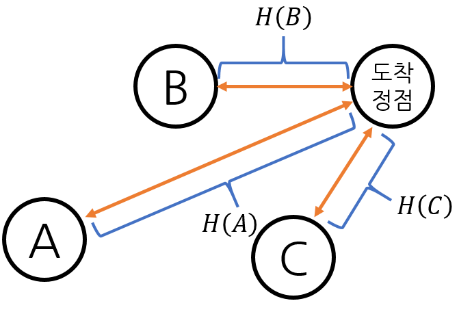
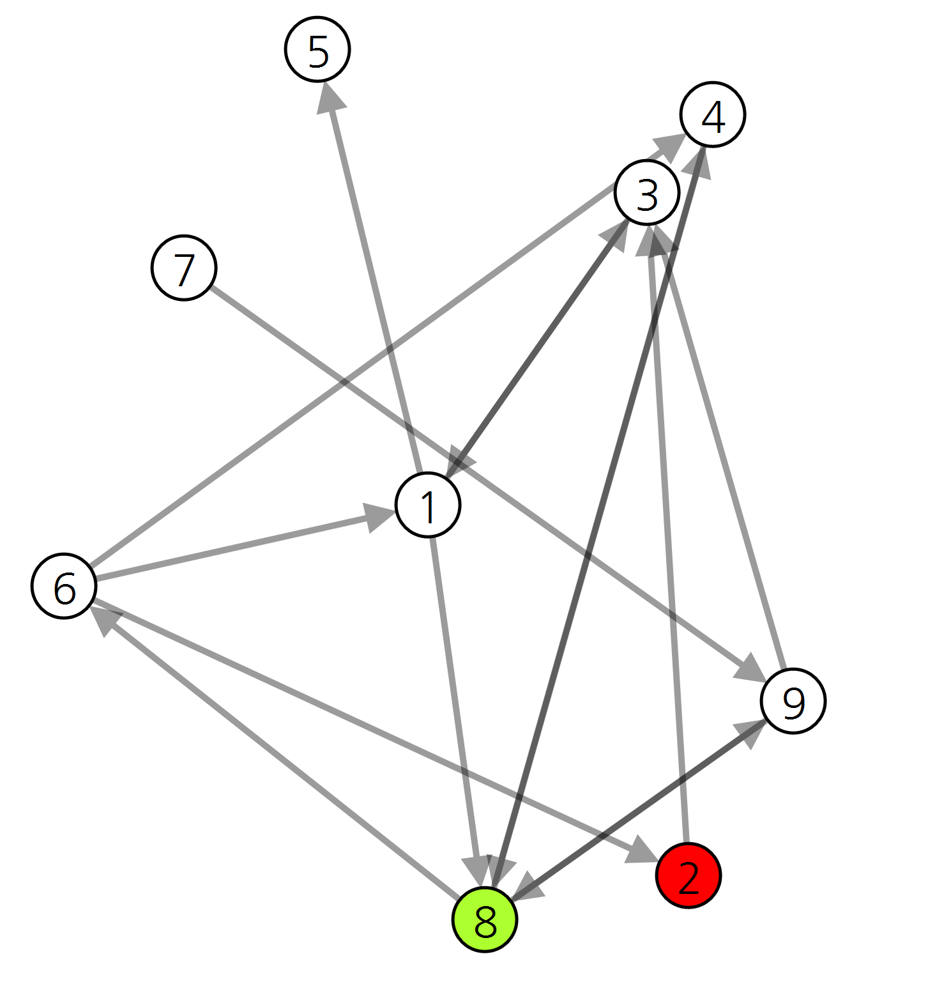
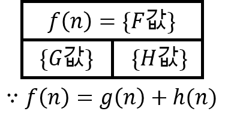
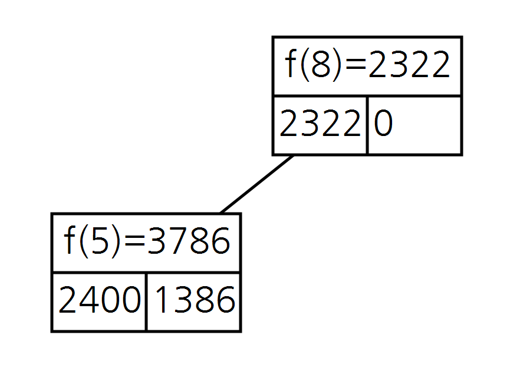
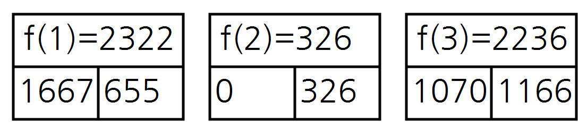

# Astar_algorithm_visualization
최소 힙(min-heap)구조를 이용하는 A* 알고리즘(A star algorithm) 시각화


**구현 영상**

[](http://www.youtube.com/watch?v=cpPWYPNl0-E)


## 0. 그대로 실행 시 주의사항
그대로 실행 시, 하위 디렉토리 ```\datas``` 에 시각화 내용에 대해 모두 저장하도록 되어 있습니다.
수많은 파일을 생성하고 싶지 않다면, ```Astar.cs``` 에서 ```Astar```클래스의 ```visualize()``` 함수를 수정하세요.

## 1. A* 알고리즘과 최소 힙
**A * 알고리즘**

 그래프에서 구현하면, 정점(Vertex)과 간선(Edge) 그리고 간선의 가중치가 부여된 그래프에서 출발 정점으로 부터 도착 정점까지의 최소 비용(경로)을 구하는 알고리즘.
 정점을 탐색할 때, 해당 정점에서의 출발 정점으로 부터 최소 비용 G(n)과 도착 정점까지의 예상 비용(휴리스틱 값) H(n)의 합인 F(n) = G(n) + H(n) 가 최소가 되는 방향으로 진행한다.
 다른 알고리즘과는 다르게 휴리스틱 추정값을 사용하기 때문에 더 높은 성능을 보일 수 있다.

**최소 힙**

 완전 이진트리(complete binary tree)에서 부모 노드가 자식 노드보다 항상 작은 자료구조로, 루트 노드에 항상 최솟값이 위치하게 된다. 데이터가 변하는 상황에서 빠르게 최솟값을 찾을 수 있기 때문에 다익스트라 알고리즘에 사용하면 시간 복잡도를 줄일 수 있다.

## 2. 휴리스틱 값 설정

 목표 정점까지의 거리가 최소가 되는 경로를 구하는 상황에 맞게 휴리스틱 값은 각 정점으로 부터 목표 정점까지의 유클리드 거리로 한다



## 3. 시각화 방법
### 3.1. 그래프 시각화
**그래프 형태 출력(간선의 가중치는 정점 사이 픽셀 거리)**




## 3.2. 정점 데이터 시각화
**정점 데이터 시각화 방법**



**힙 구조 트리 형태 출력**



**배열 형태 출력**


